# Mi Note

## 项目来源

`MiCode`便签是小米便签的社区开源版，由MIUI团队(www.miui.com) 发起并贡献第一批代码，遵循NOTICE文件所描述的开源协议，今后为`MiCode`社区(www.micode.net) 拥有，并由社区发布和维护。

项目源地址：https://github.com/MiCode/Notes

## 环境配置

**Android Studio 2024.2.2**

**Gradle 8.10.2**

**SDK 35**

**JDK 22**

> 为保障项目能够正常运行，请保证环境配置和上面一致

## 使用说明

可安装的程序包（apk文件） 在 release 文件下，直接安装运行。

## 项目结构

### 整体功能

```bash
.
├── java
│   └── net
│       └── micode
│           └── notes
│               ├── data             # 数据层：数据库操作、数据存储相关类
│               ├── gtask            # Google Tasks 功能模块
│               │   ├── data         # 任务数据处理类
│               │   ├── exception    # 自定义异常处理类
│               │   └── remote       # 远程API调用/网络通信相关
│               ├── model            # 数据模型/实体类（POJO）
│               ├── tool             # 工具类/辅助工具
│               ├── ui               # 用户界面相关（Activity/Fragment）
│               └── widget           # 自定义View/控件组件
└── res
    ├── color             # 颜色资源定义（XML格式）
    ├── drawable          # 通用图片资源（SVG/PNG）
    ├── drawable-hdpi     # 高分辨率屏幕图片资源
    ├── layout            # 布局文件（Activity/Fragment布局）
    ├── menu              # 菜单布局资源
    ├── raw               # 原生资源文件（如音频/文本）
    ├── raw-zh-rCN        # 中文（简体）原生资源
    ├── values            # 通用资源（字符串/尺寸/样式）
    ├── values-zh-rCN     # 中文（简体）本地化资源
    ├── values-zh-rTW     # 中文（繁体）本地化资源
    └── xml               # 其他XML配置（如Preference配置）
```

### 软件包

```bash
java
└── net
    └── micode
        └── notes
            ├── data                                    # 数据模型与数据库相关核心类
            │   ├── Contact.java                          # 联系人数据模型类
            │   ├── Notes.java                            # 便签基础数据模型类
            │   ├── NotesDatabaseHelper.java              # SQLite数据库帮助类，负责创建和维护数据库
            │   └── NotesProvider.java                    # ContentProvider实现，提供数据访问接口
            │
            ├── gtask                                   # Google任务同步功能模块
            │   ├── data                                  # 任务数据模型与本地存储
            │   │   ├── MetaData.java                     # 同步元数据管理类
            │   │   ├── Node.java                         # 任务树节点抽象基类
            │   │   ├── SqlData.java                      # SQLite数据操作抽象类
            │   │   ├── SqlNote.java                      # 便签数据与Google任务映射类
            │   │   ├── Task.java                         # 单个任务数据模型
            │   │   └── TaskList.java                     # 任务列表数据模型
            │   ├── exception                           # 自定义异常类
            │   │   ├── ActionFailureException.java       # 任务操作失败异常
            │   │   └── NetworkFailureException.java      # 网络连接异常
            │   └── remote                                # 远程同步服务相关
            │       ├── GTaskASyncTask.java             # 异步任务执行基类
            │       ├── GTaskClient.java                  # Google Tasks API客户端封装
            │       ├── GTaskManager.java                 # 任务同步流程管理类
            │       └── GTaskSyncService.java             # 后台同步服务实现
            │
            ├── model                                   # 业务逻辑模型
            │   ├── Note.java                             # 便签业务逻辑模型
            │   └── WorkingNote.java                      # 编辑态便签业务逻辑扩展
            │
            ├── tool                                    # 工具类与辅助方法
            │   ├── BackupUtils.java                      # 数据备份恢复工具
            │   ├── DataUtils.java                        # 通用数据操作工具
            │   ├── GTaskStringUtils.java                 # Google任务字符串处理工具
            │   └── ResourceParser.java                   # 资源解析工具类
            │
            ├── ui                                      # 用户界面相关组件
            │   ├── AlarmAlertActivity.java               # 闹钟提醒对话框
            │   ├── AlarmInitReceiver.java                # 开机启动广播接收器
            │   ├── AlarmReceiver.java                    # 闹钟事件广播接收器
            │   ├── DateTimePicker.java                   # 日期时间选择器控件
            │   ├── DateTimePickerDialog.java             # 日期时间选择对话框
            │   ├── DropdownMenu.java                     # 自定义下拉菜单控件
            │   ├── FoldersListAdapter.java               # 文件夹列表适配器
            │   ├── NoteEditActivity.java                 # 便签编辑界面Activity
            │   ├── NoteEditText.java                     # 富文本编辑控件
            │   ├── NoteItemData.java                     # 列表项数据封装类
            │   ├── NotesListActivity.java                # 主列表界面Activity
            │   ├── NotesListAdapter.java                 # 主列表数据适配器
            │   ├── NotesListItem.java                    # 列表项自定义View
            │   └── NotesPreferenceActivity.java          # 设置界面Activity
            │
            └── widget                                  # 桌面小部件实现
                ├── NoteWidgetProvider.java               # 基础尺寸便签小部件
                ├── NoteWidgetProvider_2x.java            # 2x尺寸便签小部件
                └── NoteWidgetProvider_4x.java            # 4x尺寸便签小部件
```

### 流程图

```mermaid
graph TD
    A[net.micode.notes] --> B[java]
    A --> C[res]
    
    %% Java 模块结构
    B --> D[data]
    B --> E[gtask]
    B --> F[model]
    B --> G[tool]
    B --> H[ui]
    B --> I[widget]
    
    %% data 包
    D --> D1[Contact.java]
    D --> D2[Notes.java]
    D --> D3[NotesDatabaseHelper.java]
    D --> D4[NotesProvider.java]
    
    %% gtask 包
    E --> E1[data]
    E --> E2[exception]
    E --> E3[remote]
    
    E1 --> E11[MetaData.java]
    E1 --> E12[Node.java]
    E1 --> E13[SqlData.java]
    E1 --> E14[Task.java]
    
    E2 --> E21[ActionFailureException.java]
    E2 --> E22[NetworkFailureException.java]
    
    E3 --> E31[GTaskClient.java]
    E3 --> E32[GTaskManager.java]
    E3 --> E33[GTaskSyncService.java]
    
    %% model 包
    F --> F1[Note.java]
    F --> F2[WorkingNote.java]
    
    %% tool 包
    G --> G1[BackupUtils.java]
    G --> G2[DataUtils.java]
    G --> G3[ResourceParser.java]
    
    %% ui 包
    H --> H1[NotesListActivity.java]
    H --> H2[NoteEditActivity.java]
    H --> H3[DateTimePickerDialog.java]
    H --> H4[DropdownMenu.java]
    
    %% widget 包
    I --> I1[NoteWidgetProvider.java]
    I --> I2[NoteWidgetProvider_4x.java]
    
    %% res 资源结构
    C --> C1[layout]
    C --> C2[values]
    C --> C3[drawable]
    C --> C4[menu]
    
    C1 --> C11[activity_notes_list.xml]
    C1 --> C12[fragment_edit.xml]
    
    C2 --> C21[strings.xml]
    C2 --> C22[styles.xml]
    
    %% 数据流向示例
    H1 -->|使用| D3
    H2 -->|操作| F2
    E33 -->|调用| E31
    G1 -->|依赖| D4
    I1 -->|绑定| H1
```



说明：

1. **层次结构**：采用树形结构展示代码库的物理分层
   - 根节点为项目主包 `net.micode.notes`
   - 第一层分为 Java 代码和资源文件两个主分支
   - 每个包/目录展开显示关键类文件

2. **模块关系**：
   - UI 层（`ui`）通过箭头指向数据层（`data`）和模型层（`model`）
   - Google Tasks 模块（`gtask`）内部展示数据/异常/远程三个子模块
   - 资源文件与 Java 代码通过虚线框区分

3. **典型交互**：
   ```mermaid
   graph LR
       UI[NotesListActivity] --> DB[NotesDatabaseHelper]
       DB --> CP[NotesProvider]
       CP --> SQL[(SQLite)]
       GT[GTaskManager] --> API[GTaskClient]
       API -->|HTTPS| Google[Google Tasks API]
       Widget[NoteWidgetProvider] --> UI
   ```

## 新功能
### 切换背景

### 更改字体